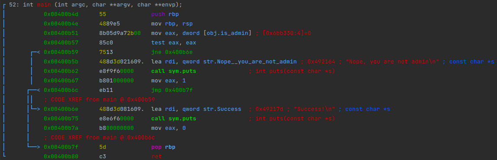
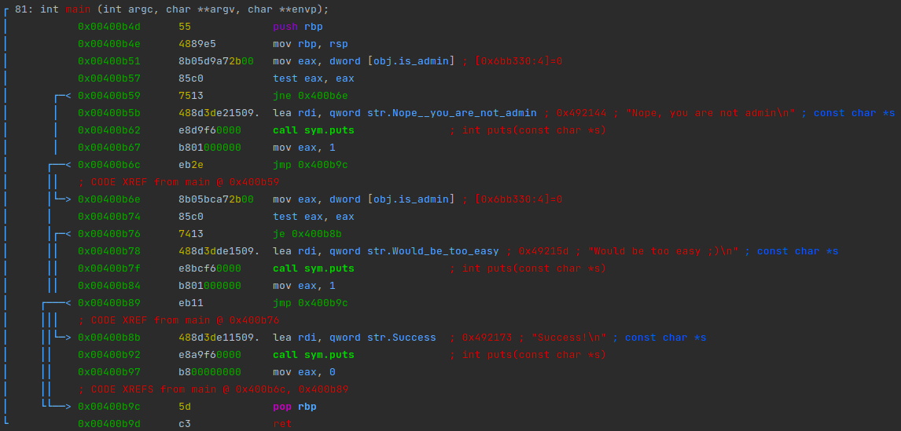
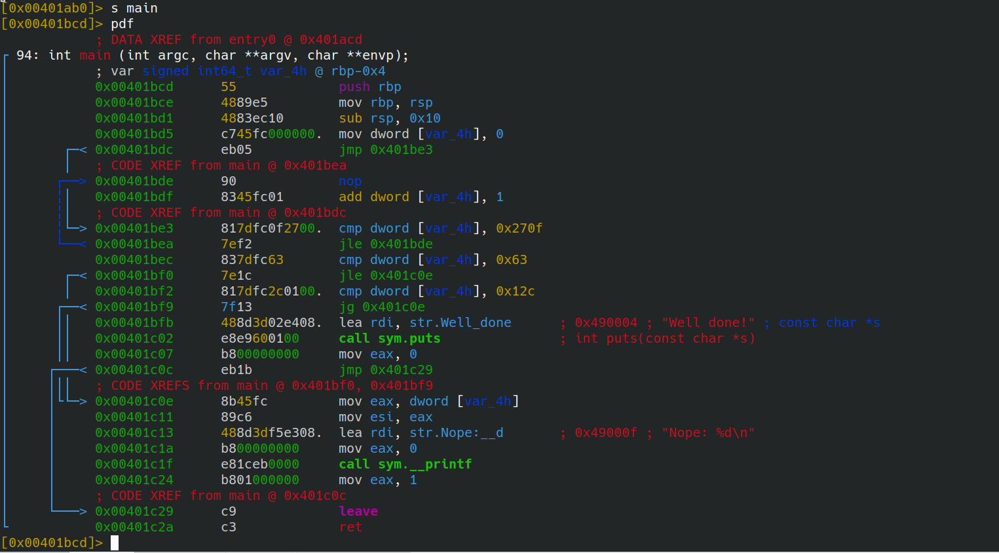

# Fault Attack Demos

This demo shows you the use of some instructions supported by the fault simulator.

## Example 1: *skip @RIP*

```c
int main() {

    asm volatile("1: jmp 1b\n");
    puts("Success!\n");
}
```

### Solution
In order to reach the success output, we would like to skip the `jmp` instruction. Therefore, we have a look at the disassemble of the main function.
```
objdump -d victim1 | awk -v RS= '/^[[:xdigit:]]+ <main>/'
```

```objdump
0000000000401bcd <main>:
  401bcd:       55                      push   %rbp
  401bce:       48 89 e5                mov    %rsp,%rbp
  401bd1:       eb fe                   jmp    401bd1 <main+0x4>
  401bd3:       48 8d 3d 2a e4 08 00    lea    0x8e42a(%rip),%rdi        # 490004 <_IO_stdin_used+0x4>
  401bda:       e8 71 f7 00 00          callq  411350 <_IO_puts>
  401bdf:       b8 00 00 00 00          mov    $0x0,%eax
  401be4:       5d                      pop    %rbp
  401be5:       c3                      retq   
```

We can see that the `jmp` instruction needs `2` bytes. Therefore, if the instruction pointer reaches position `0x401bd1`, we skip these two bytes.

In `victim1.fault`: `skip 2 @0x401bd1`

Verify the solution: `./../simulator victim1.fault victim1`


## Example 2: *bitflip*


```c
volatile int is_admin = 0;

int main() {
    if(!is_admin) {
        puts("Nope, you are not admin\n");
        return 1;
    } else {
        puts("Success!\n");
        return 0;
    }

}
```

### Solution

In order to reach the success output, we would like to set the `is_admin` variable from `0` to `1`, i.e. to perform a bitflip. We need the address of `is_admin` as well as a suitable trigger. Looking at the disassemble of the main function yields:

```objdump
0000000000400b4d <main>:
  400b4d:       55                      push   %rbp
  400b4e:       48 89 e5                mov    %rsp,%rbp
  400b51:       8b 05 d9 a7 2b 00       mov    0x2ba7d9(%rip),%eax        # 6bb330 <is_admin>
  400b57:       85 c0                   test   %eax,%eax
  400b59:       75 13                   jne    400b6e <main+0x21>
  400b5b:       48 8d 3d 02 16 09 00    lea    0x91602(%rip),%rdi        # 492164 <_IO_stdin_used+0x4>
  400b62:       e8 f9 f6 00 00          callq  410260 <_IO_puts>
  400b67:       b8 01 00 00 00          mov    $0x1,%eax
  400b6c:       eb 11                   jmp    400b7f <main+0x32>
  400b6e:       48 8d 3d 08 16 09 00    lea    0x91608(%rip),%rdi        # 49217d <_IO_stdin_used+0x1d>
  400b75:       e8 e6 f6 00 00          callq  410260 <_IO_puts>
  400b7a:       b8 00 00 00 00          mov    $0x0,%eax
  400b7f:       5d                      pop    %rbp
  400b80:       c3                      retq  
```

As an alternative to `objdump` one might want to try out `radare2`. Note that `pdf [@ addr]` stands for _print disassembly of function_.

```
radare2 victim2
aaaa
pdf @ sym.main
```





We can see that the address of `is_admin` is `0x6bb330`. We introduce the fault just before the value of `is_admin` is stored into the `eax` register for testing, i.e. when the instruction pointer reaches position `0x400b51`.

In `victim2.fault`: `bitflip 0 0x6bb330 @0x400b51`

Verify the solution: `./../simulator victim2.fault victim2`


## Example 3: *havoc* & *zero*


```c
volatile int is_admin = 0;

int main() {
    if(!is_admin) {
        puts("Nope, you are not admin\n");
        return 1;
    } else {
        if(is_admin) {
            puts("Would be too easy ;)\n");
            return 1;
        }
        puts("Success!\n");
        return 0;
    }

}
```

### Solution

In order to reach the success output, two steps need to be accomplished: Setting the `is_admin` variable to some non-zero value before the first if-clause, and setting it back to zero before the second if-clause. Again, we need the address of `is_admin` as well as two suitable triggers. Looking at the disassemble of the main function yields:

```objdump
0000000000400b4d <main>:
  400b4d:       55                      push   %rbp
  400b4e:       48 89 e5                mov    %rsp,%rbp
  400b51:       8b 05 d9 a7 2b 00       mov    0x2ba7d9(%rip),%eax        # 6bb330 <is_admin>
  400b57:       85 c0                   test   %eax,%eax
  400b59:       75 13                   jne    400b6e <main+0x21>
  400b5b:       48 8d 3d e2 15 09 00    lea    0x915e2(%rip),%rdi        # 492144 <_IO_stdin_used+0x4>
  400b62:       e8 d9 f6 00 00          callq  410240 <_IO_puts>
  400b67:       b8 01 00 00 00          mov    $0x1,%eax
  400b6c:       eb 2e                   jmp    400b9c <main+0x4f>
  400b6e:       8b 05 bc a7 2b 00       mov    0x2ba7bc(%rip),%eax        # 6bb330 <is_admin>
  400b74:       85 c0                   test   %eax,%eax
  400b76:       74 13                   je     400b8b <main+0x3e>
  400b78:       48 8d 3d de 15 09 00    lea    0x915de(%rip),%rdi        # 49215d <_IO_stdin_used+0x1d>
  400b7f:       e8 bc f6 00 00          callq  410240 <_IO_puts>
  400b84:       b8 01 00 00 00          mov    $0x1,%eax
  400b89:       eb 11                   jmp    400b9c <main+0x4f>
  400b8b:       48 8d 3d e1 15 09 00    lea    0x915e1(%rip),%rdi        # 492173 <_IO_stdin_used+0x33>
  400b92:       e8 a9 f6 00 00          callq  410240 <_IO_puts>
  400b97:       b8 00 00 00 00          mov    $0x0,%eax
  400b9c:       5d                      pop    %rbp
  400b9d:       c3                      retq   
  400b9e:       66 90                   xchg   %ax,%ax
```

As an alternative to `objdump` one might want to try out `radare2`. Note that `pD [n] [@ addr]` stands for _print disassembly_ (of n bytes).

```
radare2 victim3
aaaa
pD 81 @ sym.main
```



We can see that the address of `is_admin` is `0x6bb330`. We decide to use `havoc` to set the value of `is_admin` to a random value, and to use `zero` to set it back to zero.


In `victim3.fault`: : `havoc 0x6bb330 @0x400b4e` `zero 0x6bb330 @0x400b6e`

Verify the solution: `./../simulator victim3.fault victim3`


# Example 4: *skip #Instructions*


```c
int main() {
    int i;
    for(i = 0; i < 10000; i++) {
        asm volatile("nop");
    }
    if(i >= 100 && i <= 300) {
        printf("Well done!\n");
        return 0;
    } else {
        printf("Nope: %d\n", i);
    }
    return 1;
}
```

### Solution

In order to reach the success output, we want to early-break from the loop after a sufficient amount of iterations has been performed. Looking at the disassemble of the main function yields:

```objdump
0000000000401bcd <main>:
  401bcd:       55                      push   %rbp
  401bce:       48 89 e5                mov    %rsp,%rbp
  401bd1:       48 83 ec 10             sub    $0x10,%rsp
  401bd5:       c7 45 fc 00 00 00 00    movl   $0x0,-0x4(%rbp)
  401bdc:       eb 05                   jmp    401be3 <main+0x16>
  
  401bde:       90                      nop
  401bdf:       83 45 fc 01             addl   $0x1,-0x4(%rbp)
  401be3:       81 7d fc 0f 27 00 00    cmpl   $0x270f,-0x4(%rbp)
  401bea:       7e f2                   jle    401bde <main+0x11>
  
  401bec:       83 7d fc 63             cmpl   $0x63,-0x4(%rbp)
  401bf0:       7e 1c                   jle    401c0e <main+0x41>
  401bf2:       81 7d fc 2c 01 00 00    cmpl   $0x12c,-0x4(%rbp)
  401bf9:       7f 13                   jg     401c0e <main+0x41>
  401bfb:       48 8d 3d 02 e4 08 00    lea    0x8e402(%rip),%rdi        # 490004 <_IO_stdin_used+0x4>
  401c02:       e8 e9 60 01 00          callq  417cf0 <_IO_puts>
  401c07:       b8 00 00 00 00          mov    $0x0,%eax
  401c0c:       eb 1b                   jmp    401c29 <main+0x5c>
  401c0e:       8b 45 fc                mov    -0x4(%rbp),%eax
  401c11:       89 c6                   mov    %eax,%esi
  401c13:       48 8d 3d f5 e3 08 00    lea    0x8e3f5(%rip),%rdi        # 49000f <_IO_stdin_used+0xf>
  401c1a:       b8 00 00 00 00          mov    $0x0,%eax
  401c1f:       e8 1c eb 00 00          callq  410740 <_IO_printf>
  401c24:       b8 01 00 00 00          mov    $0x1,%eax
  401c29:       c9                      leaveq 
  401c2a:       c3                      retq
```

As an alternative to `objdump` one might want to try out `radare2`. Note that `s [addr|flag]` stands for _seek_.


```
radare2 victim4
aaaa
s main
pdf
```




We can see that the conditional jump which finally breaks the loop if the break condition is fulfilled is checked at the address `0x401bea`. Thus, after a suffictient number instructions, we want to skip `2` byte at the address `0x401bea`. Use the instruction count to skip after **n** instructions.

To find the instruction which lies in the correct range:

In `victim4.fault`: `log rip` `log inscnt`
```
./../simulator victim4.fault victim4 2>/dev/null | grep "401bea" -A 2 | head -n 15
```
We will get something like
``` 
RIP: 0x401bea
Instruction #38645
RIP: 0x401bde
--
RIP: 0x401bea
Instruction #38649
RIP: 0x401bde
--
RIP: 0x401bea
Instruction #38653
RIP: 0x401bde
--
RIP: 0x401bea
Instruction #38657
RIP: 0x401bde
```
Thus, the first time the code reaches the conditional jump that 
could break the loop is after `38645` instructions. After `4` more instructions, 
the conditional jump instruction is reached again.

In order to succeed this challenge, we need `100 <= i <= 300`. Thus, the instruction count
needs to be between `38645 + 100 * 4` and `38645 + 300 * 4`.

In `victim4.fault`: `skip 2 #38645`

Verify the solution: `./../simulator victim4.fault victim4`

