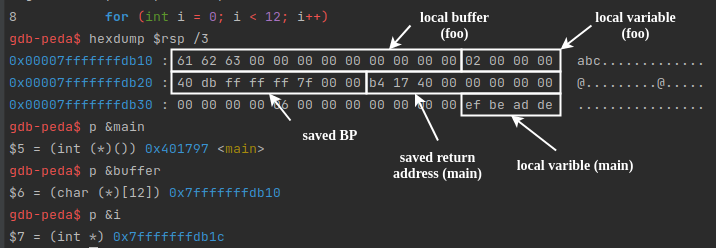
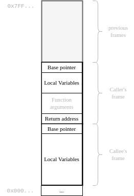
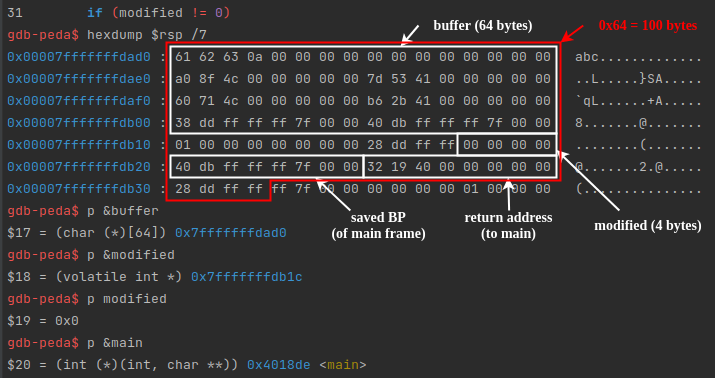
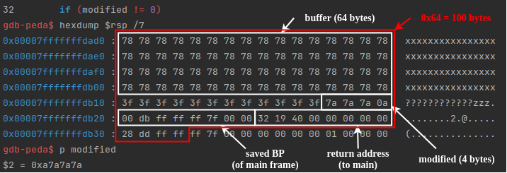

# Hacklet Demos

This demo shows you some common security vulnerabilities and how to exploit them. See the lecture "System Security 1 - Memory Safety" for more information.

We strongly recommend to try the examples presented here and in the lecture on your own. Nevertheless, these examples are minimal examples which only aim to show you how individual flaws might be exploited. In the exercise tasks, a combination of those might be needed to reveal the secret information.

## 0. Stack Management

In this demo we will mainly deal with data located on the stack. Thus, let's start with a brief reminder on how data on the stack is managed.

Remember that for each function call, new space (called stack frame) is created on the stack. We consider the following example, where the function `foo` is called from within `main` (see also [demo0](demo0)):
```c
void foo()
{
    // do something
    char buffer[12];

    for (int i = 0; i < 12; i++)
    {
        buffer[i] = 'a' + i;
    }
    buffer[11] = '\0';

    printf("Buffer content: %s\n", buffer);
}

int main()
{
    int volatile local = 0xDEADBEEF;
    foo();
    return 0;
}
```

The following image shows a memory dump of the stack, starting at address `rsp` (the current stack pointer) and showing 3 lines à 16 bytes.



As we can see, the stack frame of the function `foo` has a lower address range than the one of `main`. 



Depending on the architecture, function arguments might also be placed on the stack. Make yourself familiar which the different calling conventions (in particular, `cdecl` for 32-bit systems and `System V` for 64-bit systems). 

In addition to that, the compiler might add some padding, stack canaries etc. for performance and security reasons.

---
## 1. (Stack) Buffer Overflow

Buffer overflows occur when data is written outside of the boundaries of the memory allocated to a particular data structure. A buffer overflow can lead to a _vulnerability_ if an attacker can manipulate user-controlled inputs to _exploit_ the security _flaw_.

Whenever data is placed _above_ (higher address) a local buffer and this buffer is susceptible to overflow, this data might be manipulated by an attacker. Since we are talking about local buffers (placed on the stack), local variables within the same stack frame as well as previous stack frames (containing return addresses) might get corrupted.


### 1.1. Overwrite local variables 

Let's consider the following example (cf. [demo1](demo1)), taken from the FuzzyLand CTF challenges (see https://fuzzy.land/challenges, binary_exploitation_101, Buffer Overflow 0).


```c
void vuln(void)
{
  volatile int modified;
  char buffer[64];

  modified = 0;
  fgets(buffer, 0x64, stdin);

  if (modified != 0)
  {
    print_flag();  // CAN WE GET HERE?
    exit(0);
  }
  else
  {
    puts("Nope! Needs a little more juice!");
    exit(1);
  }
}
```

In the function `vuln`, a local buffer (`64 bytes`) is allocated. 
The (secure) function `fgets` reads in at most one less than the provided size (`0x64`) characters from `stdin` and stores them into the `buffer`. 
Reading stops after an EOF or a newline. Unfortunately, the programmer was not careful when providing the input size, since `0x64 = 100 bytes`. 
Thus, whenever the user enters more than `64 bytes`, stack memory is corrupted. This is illustrated in the following picture.



We can see that, due to the stack layout, we can overwrite the local variable `modified` (and other values such as the saved `return address`, cf. [section 1.2](#12-overwrite-return-addresses)) with a user-defined value. 
Any non-zero value would be a good choice, since our goal is to call the function `print_flag()`.

By providing 64 characters to fill the buffer, some characters to fill the padding (system- and compiler-dependent), and 4 more bytes which are not all zero (3 plus `\n`), we overwrite the variable `modified`. Following the control flow, the function `print_flag()` is then called.
```
xxxxxxxxxxxxxxxxxxxxxxxxxxxxxxxxxxxxxxxxxxxxxxxxxxxxxxxxxxxxxxxx????????????zzz
```



The inattentive programmer could have prevented this issue in the first place by reading the compiler warnings and taking them serious:
```
    demo1.c: In function ‘vuln’:
    demo1.c:30:3: warning: ‘fgets’ writing 100 bytes into a region of size 64 overflows the destination [-Wstringop-overflow=]
        30 |   fgets(buffer, 0x64, stdin);
           |   ^~~~~~~~~~~~~~~~~~~~~~~~~~
```

### 1.2. Overwrite return addresses

Mitigation: Stack canary -> when does it help? (Example)
Mitigation: ASLR


### 1.3. Inject code 

So far content of buffer was not relevant.

Source: Code Injection (65)

Buffer should not be executable (write or execute security)


---
## 2. Format String Vulnerabilities


There are several format string vulnerabilities that can be very dangerous since they can allow an attacker to leak large amounts of memory and write to it as well.

In the following sections, we will discuss string format vulnerabilities and how they can be exploited. 


### 2.1 Demo
To demonstrate how format string vulnerabilities can be exploited, we have prepared a small [demo2](demo2).

A program is provided to us that reads in a username that we can provide.
The username is read into a stack variable that cannot be overflown.


```C
char username[64] = {0};
read_flag(flag);    

puts("Please enter your username");
printf("> ");
fgets(username, 64, stdin);
```

After providing the program with a username it prints out `Hello: ` followed by the username we just provided.

```C
printf("Hello: ");
printf(username);
printf("\n");
```

The username, however, is printed without the use of a format string.
In other words, whatever is contained within the username variable, which is controlled by us, is handled by printf in the same manner as any other string which may include format strings.

For example if we provide "`%x %x`" as the username this would be the same as writing `printf("%x, %x")`.
When printf receives format strings but not parameters, what does it do?
As a result, Printf uses the values that should be stored for the parameters. 
In 32-bit binaries, it's the stack; in 64-bit binaries, it's the registers and stack.
This means an attacker could exploit this string format vulnerability.
There are two main approaches to exploiting a format string vulnerability. 
It is possible to leak memory or write to memory.

### 2.2. View memory content 

With format string vulnerabilities an attacker is able to leak memory of the current program.
When a string is provided to printf as the only argument, printf assumes that the string may also contain format strings. 
As a result, register and stack addresses can leak.

There is a difference in the way 64-bit and 32-bit binary values are handled, which causes the leaked values to vary depending on the architecture. 

As an example printf should be called like so
```C
printf("%x",number);
```
Printf receives the format string containing "%x".
As a result, Printf will assume that there is a second argument because the format string contains "%x".
In this case there will be a second argument which is called number and printf will print out the value of this argument. 


However if printf is called without a second argument but the format string still contains "%x", printf will assume that a second parameter is supplied.

```C
printf("%x");
```

In this case there is no number so printf will just take the value where the parameter is supposed to be and use it.


### 2.3. Overwrite memory content 

We can also overwrite memory with a format string vulnerability.

Using the format string `%n` we can overwrite values on the stack (local variable, return address).
We are therefore also able to overwrite return addresses without damaging the stack canaries. 

Due to this, stack canaries do not mitigate this type of attack.
It is possible to mitigate this issue by using ASRL, which makes it more difficult because %n needs an address to overwrite. 
Nevertheless, if the attacker leaks addresses on the stack, they can calculate the offset to all other addresses in the binary and exploit it.

---
## 3. Use after Free (UAF)

UAF (use after free) [demo3](demo3)

Use after free is a temporal memory violation.

UAF describes a vulnerability where at some point in time memory was correctly allocated and freed but is used again after being freed.


If the user is allowed to allocate new memory and free memory, one must be careful not to introduce a UAF vulnerability. 
UAF vulnerabilities are especially difficult to catch because it is difficult to identify them before runtime. 
Often times, UAF bugs require a certain succession of allocations and frees to be exploitable.

Demo3 showcases such a vulnerability. 
We are provided with 3 choices

```
1. Read user_secret
2. Delete user
3. Exit
```

We have an `admin` user and a `default_user`.
Each user has a `user_secret` but we are only allowed to access the user secret of the default user. 
If we have a look at the code that access the user secret, we can see that there exists an access array which needs to be set to 1 to read the `user_secret` of this user.


```c
int user_id = getUserId();
if (access[user_id] == 1){
  printf("User secret: %s\n", user[user_id]->user_secret);
}
else{
  puts("Access denied");
}
```
If we now have a look at the delete user option, we can see that the memory is freed and the access bit is set to 1. 

```c
int user_id = getUserId();
free(user[user_id]);
access[user_id] = 1;
```

If we free the `admin` user, the memory access bit is set to 1, and we now pass the access check from before.
The memory is freed, but inside the `user[]` array, the pointer to the memory still exists.
We can therefore just access the secret of the admin, since all data on the heap is also still there.